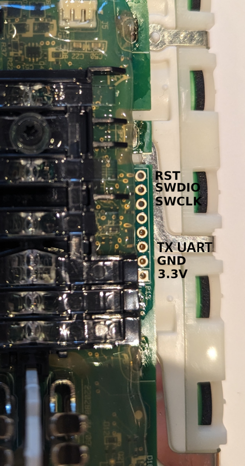

# V11_Dyson_BMS

Aftermarket firmware for Dyson V11/V15 Battery Management Systems.

Based on https://github.com/davidmpye/V10_Dyson_BMS and https://github.com/vladislav1983/V11_Dyson_BMS

By using this project, you acknowledge and agree to the following:

The author and contributors are NOT responsible for any damage, injury,
loss, or legal consequences resulting from the use or misuse of this project.

This project is provided for educational, experimental, and research purposes only.

Improper battery management can result in thermal runaway, fire, toxic fumes,
or explosion.

IF YOU DO NOT FULLY UNDERSTAND THE RISKS OF LITHIUM BATTERIES, DO NOT USE THIS PROJECT.

## What's New (July - September 2026)

### What you will notice

- **A faulted pack no longer drains itself flat.** The fault state used to loop
  forever: blinking its code, running the MCU and the AFE from the cells, with
  no way out but pulling the trigger or docking - so a pack that faulted
  because it was already empty kept discharging until the cells were ruined.
  Now the blinking stops after 5 minutes and the pack shuts down to SHIP mode
  (after 5 minutes for a fault that needs attention, 2 hours for one that
  clears on its own), saving the fuel gauge on the way. On the dock the same
  applies once a charge has had 30 minutes to start and has not.
- **Cell balancing.** A docked, charged pack now bleeds its highest cells down
  to the others. The LEDs alternate left and right while it does.
  See [Cell Balancing](#cell-balancing).
- **Hybrid trigger, now the default.** A short press latches the motor on,
  press and hold works like the stock trigger. The latch drops when the
  cleaner is docked, on any fault, and after 30 minutes. See [Trigger](#trigger).
- **Storage mode.** A pack left docked and unused for about two weeks is kept
  around 3.9 V per cell instead of topped up to full. See [Storage Mode](#storage-mode).
- **A spare pack in a charger goes to standby** after 5 minutes instead of
  staying awake indefinitely.
- **No charge current = shut down.** A pack that sees a charger but cannot take
  charge (blown fuse, bad contacts) shows it with a one-LED blink and goes to
  SHIP mode after 5 minutes instead of draining itself on the dock.
- **Charging temperature window** 40 C to start, 45 C to stop, and both
  thermistors are now read - the hotter one decides.
- **Gentler full charge.** Full at 4150 mV per cell under current (was 4170),
  top-up below 4080 mV, four 60 s settling pauses at the end of a charge.
- **Readable fault codes.** Short flashes = clears itself, long flashes = needs
  attention, count = which fault. See [Fault Codes](#fault-codes).
- **Fuel gauge.** Default capacity is now 4000 mAh (`PACK_MAX_CAPACITY_MAH`),
  corrected by the first full cycle. The learned capacity can go up as well as down, is
  saved as soon as it is learned, and the displayed percentage no longer reads
  2.4% high.
- **Mode button wakes the pack** from protocol sleep again, and a pack no longer
  sleeps through a wake that arrives just before standby.
- **The motor no longer silently loses power** after a glitch: discharge is
  re-armed on every run, after an absorbed AFE event, and retried if arming
  failed.
- **A detailed debug log** on the programming header. See [Debug Log](#debug-log).

### Reliability and safety

- Every BQ7693 register read is CRC-checked and retried; a dead or noisy bus
  now faults as "BQ7693 unreachable" instead of acting on garbage, and the FET
  controls never write back a register value that was not actually read.
- AFE fault bits (internal fault, external ALERT) are no longer silently
  cleared and forgotten; short transients are tolerated, persistent ones fault.
- A latched AFE status bit can no longer stop coulomb counting for good.
- Faults raised by the watchdog are actually acted on, and a spurious watchdog
  fault on every sleep entry is gone.
- A cell reading near 0 V is treated as a broken measurement, not a flat pack,
  so it no longer wipes the fuel gauge.
- The BQ7693 undervoltage flag no longer blocks charging a deeply discharged
  pack.
- A failed charge-FET enable is detected instead of sitting in "charging"
  with nothing happening.
- Temperature and overcurrent faults recover on their own for up to 2 hours
  instead of shutting the pack down after 5 minutes.

### Small fixes

- Rounding and integer range: SOC scale factor, current filter overflow above
  32 A, SOC capacity narrowed to 16 bits, protocol frame index overflow, NTC
  table read past its end on an ADC error, negative ADC offset wrapping a 0 mV
  cell to ~65 V.
- Input debounce did not debounce at all.
- Shared interrupt variables marked `volatile`.
- EEPROM: written only when something changed, no struct padding in the CRC,
  layout marker so a reflash with an incompatible layout resets cleanly.
- Coulomb counter polled often enough not to lose readings; protocol no longer
  re-sends a frame on sleep entry; nested delays no longer cut each other short.
- Stack 2 KB instead of 1 KB, debug buffers sized for the longest lines, a
  small printf that frees ~2.9 KB of flash.

## Supported Hardware

### MCU

| Parameter | Value |
|-----------|-------|
| Part | Microchip ATSAMD20E15 |
| Core | ARM Cortex-M0+ |
| Flash | 32 KB (1 KB reserved for EEPROM emulation) |
| RAM | 4 KB |

### BMS Frontend

| Parameter | Value |
|-----------|-------|
| Part | Texas Instruments BQ7693003 |
| Interface | I2C (address 0x08) |
| Cells | 7S |
| Features | Cell voltage monitoring, coulomb counter, charge/discharge FET control, OV/UV/OCD/SCD protection |

### Supported Vacuum Models

- Dyson V11 (click-in and screw-type motor head)
- Dyson V15
- Dyson V12 (set `TRIGGER_TOGGLE_MODE` to 1 in `config.h` — see below)

The firmware implements the Dyson serial protocol with TLV-based communication.
Cell-voltage registers `0x2301`..`0x2307` and cell min/max return a shared
snapshot of the measured cells for each request frame. Full-charge capacity is
the learned value in 0.01 mAh units. Version reads honor their offset, and
masked-write requests `0x8216` receive the raw `0x0001` acknowledgement; the
requested masked value is still not applied. The existing nonblocking protocol
sleep and mode-button wake behavior are preserved.

BQ7693 initialization stops at the first failed step. An incomplete setup cannot
be treated as healthy by later safety checks. FET disables report transfer
failures, discharge enables check every setup/restore write, and fault requests
survive ordinary state transitions. The displayed SOC is zero for discharged/UV
faults, and runtime calculation retains precision before its final division.

### Compile-time Options (`config.h`)

| Define | Default | Purpose |
|--------|---------|---------|
| `TRIGGER_TOGGLE_MODE` | `2` | Trigger behaviour. `0` = momentary (hold to run, the V11/V15 behaviour). `1` = toggle (each press flips run/stop; hold past `TRIGGER_HOLD_MS` to force stop). `2` = hybrid, see [Trigger](#trigger). Set to `1` for the Dyson V12, whose trigger is a click-to-latch button rather than a held switch. |
| `PACK_MAX_CAPACITY_MAH` | `4000` | Capacity of ONE fitted cell (the pack is 7S1P). Only a starting point - the first full cycle learns the real figure within 30%..120% of it (1200..4800 mAh at 4000). Also seeds the defaults; the cleaner receives the learned full-charge capacity. Original Dyson cells are 3600. |
| `CELL_BALANCE_ENABLE` | `1` | Passive cell balancing on the dock, see [Cell Balancing](#cell-balancing). `0` compiles it out. |
| `SHIP_MODE_ENABLE` | `1` | `0` keeps the pack from ever entering SHIP mode - a bench setting, see [Sleep and Wake](#sleep-and-wake). |
| `SERIAL_DEBUG`, `PROT_DEBUG_PRINT` | `1` | Debug log, see [Debug Log](#debug-log). Set either switch to `0` to disable its output; set both to `0` to disable the debug UART. |

All thresholds and timeouts mentioned below are in `config.h`, with the
reasoning behind each value next to it.

## Build Toolchain

### Requirements

- `arm-none-eabi-gcc` (GCC ARM Embedded toolchain)
- `cmake` >= 3.20
- `make`
- `openocd` with J-Link support (for flashing)

### Building

```bash
cd V11_BMS

# Configure and build (Debug)
make all

# Or Release build
make all BUILD_TYPE=Release

# Flash via OpenOCD + J-Link SWD
make flash

# Unlock a firmware-protected Dyson pack (full chip erase)
make unlock

# Clean
make clean
```

Alternatively, open `V11_BMS.atsln` in Microchip/Atmel Studio 7.

### Flashing

#### Programming connections


The programming header uses SWD. The marked pads are shown below.

<p align='center'>
  
</p>

Programming-header image based on the original
[V10_Dyson_BMS flashing documentation](https://github.com/davidmpye/V10_Dyson_BMS/wiki/Flashing).

##### Required connections

| Battery pad | Adapter signal | Notes |
|-------------|----------------|-------|
| `SWDIO` | SWDIO | Bidirectional data |
| `SWCLK` | SWCLK | Clock |
| `GND` | GND | A common ground is mandatory |
| `RST` | RESET/nRESET | Recommended; may be required when recovering a protected device |
| `3.3V` | VTref/VTG sense input only | Connect only when the adapter requires a target-voltage reference |

> [!WARNING]
> The battery generates its own 3.3 V rail after it is awakened. Do not connect
> a programmer's 3.3 V power **output** to the battery's 3.3 V rail. J-Link
> `VTref` and Atmel-ICE `VTG` are voltage-sense inputs and may be connected to
> the battery's 3.3 V pad. Never connect the Raspberry Pi 3.3 V power pin.

The programming pads and cell connections may remain electrically live while
the case is open. Insulate tools and loose wires, and do not drill into a closed
battery pack. Press the battery trigger immediately before connecting so that
the BMS wakes and enables the MCU's 3.3 V supply. If detection fails, wake the
pack again and retry at a lower SWD clock.


Requires one of:

- J-Link debug probe connected via SWD. OpenOCD configuration is in `openocd_samd20.cfg`.
- Atmel ICE programmer via SWD.  OpenOCD configuration is in `openocd_samd20_ice.cfg`.
- ST-Link via SWD with OpenOCD 0.12.0 or newer, using `openocd_samd20_stlink.cfg`.
- A CMSIS-DAP probe such as a DAPLink, with the prebuilt Windows OpenOCD package
  `daplink-openocd-samd-coldplug-win64.zip` from the releases - see below.

(Update the CMakeLists.txt to point to the correct configuration file for your programmer)

#### With a DAPLink / CMSIS-DAP probe

A pack still running the original Dyson firmware has the SAMD20's security bit
set, and a stock OpenOCD cannot attach to it at all. The release package
carries an OpenOCD built with `cmsis_dap_init_samd_cold_plug`, which attaches
to a secured SAMD and chip-erases it, plus ready-made scripts:

1. Wire SWDIO, SWCLK, GND **and nRESET** - the cold-plug sequence works through
   the reset line, and the probe must actually drive it (not every DAPLink
   does). Wake the pack with the mode button or the charger.
2. `check.cmd` - attach and list the target.
3. `erase.cmd` - once per pack: unlocks it by erasing everything, including the
   original firmware, which cannot be restored.
4. Copy `samd20_firmware.elf` from the firmware release into `bin`, run
   `flash_fw.cmd`.
5. Unplug the probe - see [Sleep and Wake](#sleep-and-wake) for why.

The package's own README has the details and the OpenOCD patch.

#### ST-Link with OpenOCD


ST-LINK/V2, ST-LINK/V2-1, and STLINK-V3 probes can use the supplied
`V11_BMS/openocd_samd20_stlink.cfg` configuration. This uses the probe only as
an ARM SWD adapter; the target remains the Microchip ATSAMD20E15.

Upstream reports successful programming and verification with this setup:

| Component | Tested configuration |
|-----------|----------------------|
| Host | Windows / PowerShell |
| Probe | ST-LINK/V2, firmware `V2J37S7`, API v2, USB `0483:3748` |
| OpenOCD | xPack `0.12.0+dev-02228-ge5888bda3-dirty` (2025-10-04 build) |
| Target | `SAMD20E15A`, 32 KB flash, 4 KB RAM |
| SWD speed | 100 kHz |

Use OpenOCD 0.12.0 or newer. On Windows, a prebuilt package is available from
[xPack OpenOCD](https://github.com/xpack-dev-tools/openocd-xpack/releases).
Extract the complete package and add its `bin` directory to `PATH`, or invoke
`openocd.exe` by its full path. For example, if extracted to `C:\Tools\OpenOCD`:

```powershell
& "C:\Tools\OpenOCD\bin\openocd.exe" --version
$env:Path = "C:\Tools\OpenOCD\bin;" + $env:Path
```

The `PATH` change above applies only to the current PowerShell session. For a
persistent setup, add that directory to your Windows user `PATH`.

Connect `SWDIO`, `SWCLK`, and `GND`. `NRST` is optional. On an official probe,
connect a verified target-voltage sense input to the battery's `3.3V` pad when
required. On common ST-Link/V2 dongles, pins labelled `3.3V` or `5V` are often
power outputs: leave them disconnected and let the battery power itself.
Wake the battery immediately before connecting so the MCU has power.

Build the fork in Debug first. With the ARM toolchain, CMake and Ninja on
`PATH`, run from the repository root (also works in Linux/WSL):

```text
cmake -S V11_BMS -B V11_BMS/build-debug-lto -G Ninja -DCMAKE_TOOLCHAIN_FILE=cmake/arm-none-eabi.cmake -DCMAKE_BUILD_TYPE=Debug
cmake --build V11_BMS/build-debug-lto --parallel 4
```

Check that `V11_BMS/build-debug-lto/samd20_firmware.elf` exists before flashing.
The directory name does not select the adapter: the OpenOCD configuration does.
If using another build directory, adjust the image paths below.

Start in the repository root, or skip `cd V11_BMS` if already in that directory.
Each OpenOCD command is on one line and works in PowerShell:

```powershell
cd V11_BMS
openocd --version

# Test the SWD connection; halts the MCU without erasing flash
openocd -f openocd_samd20_stlink.cfg -c "adapter speed 100" -c "init; reset halt; targets; exit"

# Program, verify, and reset an already unlocked device
openocd -f openocd_samd20_stlink.cfg -c "adapter speed 100" -c "program build-debug-lto/samd20_firmware.elf verify reset exit"
```

Use these explicit commands for ST-Link: the project's `make flash` target
currently selects the J-Link configuration.

The successful programming log ends with:

```text
** Programming Finished **
** Verify Started **
** Verified OK **
** Resetting Target **
shutdown command invoked
```

`Verified OK` confirms that flash matches the image. It does not validate BMS
operation; check the UART diagnostics and battery behaviour after programming.

##### Hardware reset after flashing (NRST connected)

Use this sequence only when the ST-Link `NRST` output is connected to the
battery's `RST` pad. The default configuration does not declare a connected
hardware reset signal; the following options enable it for this invocation.

From `V11_BMS`, program and verify the image, then explicitly reset and run the
MCU through NRST before closing OpenOCD. This example uses the fork Debug HEX;
adjust the image path if downloaded or built elsewhere (ELF works too):

```powershell
openocd -f openocd_samd20_stlink.cfg -c "adapter speed 100" -c "reset_config srst_only srst_gates_jtag" -c "adapter srst pulse_width 100" -c "adapter srst delay 100" -c "program build-debug-lto/samd20_firmware.hex verify; reset run; sleep 500; targets; shutdown"
```

`program ... verify` leaves OpenOCD open for the subsequent `reset run`. Do not
add `exit` to `program` in this sequence: it would close OpenOCD before that
reset command. The reset pulse and post-reset delay are each 100 ms; the final
500 ms wait allows startup before reporting the target state.

If programming has already completed successfully, reset without rewriting
flash using:

```powershell
openocd -f openocd_samd20_stlink.cfg -c "adapter speed 100" -c "reset_config srst_only srst_gates_jtag" -c "adapter srst pulse_width 100" -c "adapter srst delay 100" -c "init; reset run; sleep 500; targets; shutdown"
```

These command options have been checked against the documented xPack build,
but this NRST sequence has not yet been hardware-validated for this project.
If `Size 1 not supported`, `dsu_reset_deassert`, or `Unable to reset target`
errors remain, reset handling is still failing; do not treat the operation as
a successful startup. Keep the full log for diagnosis. Do not disable the DSU
reset handler or use chip erase as a workaround.

##### Unlocking a protected device

Only if the device is still protected, a full erase/unlock is required before
programming. **This permanently removes the original firmware and erases saved
flash data.** Prepare the replacement image first. The following unlock sequence
was not exercised in the successful ST-Link test above:

```powershell
openocd -f openocd_samd20_stlink.cfg -c "adapter speed 100" -c "init; mwb 0x41002100 0x10; sleep 500; reset; exit"
```

After a successful unlock, run the program command before disconnecting the
adapter. Skip the separate full erase when updating an already unlocked device.

##### Troubleshooting

- **`openocd` is not recognized:** check the executable path and `PATH` setup above.
- **`Error: open failed`:** OpenOCD could not open the USB probe. Check that Windows
  detects ST-Link in Device Manager, try another USB port/data cable, and close
  other software using the probe. If its driver is missing, install
  [STSW-LINK009](https://www.st.com/en/development-tools/stsw-link009.html).
- **Deprecated `stlink-dap.cfg` / `dapdirect_swd`:** these warnings appeared in the
  successful test and do not prevent programming with that xPack build. The supplied
  configuration retains the OpenOCD 0.12.0 names; the tested newer build accepts
  them as compatibility aliases. Its
  [ST-Link compatibility script](https://github.com/openocd-org/openocd/blob/e5888bda3/tcl/interface/stlink-dap.cfg)
  forwards to `interface/stlink.cfg`.
- **Direct DAP is unsupported:** check the probe firmware version. Older ST-Link
  firmware may need an update before it can use this transport.

## Initial Battery Calibration

After flashing the firmware, the EEPROM is initialized with default values:

| Parameter | Default Value |
|-----------|---------------|
| Total pack capacity | `PACK_MAX_CAPACITY_MAH` (config.h) |
| Current charge level | 50% of `PACK_MAX_CAPACITY_MAH` |

The SOC displayed on the vacuum will be inaccurate until the firmware learns the true pack capacity.

### Recommended First-Use Calibration

1. **Full discharge** — use the vacuum until the battery cuts off (a cell below `CELL_LOWEST_DISCHARGE_VOLTAGE`, or the BQ7693 undervoltage trip). This anchors the charge counter to zero and sets the `full_discharge_seen` flag.
2. **Full charge** — plug in the charger and let it charge to completion (`FULL_CHARGE_PAUSE_COUNT` pauses, see [Charging](#charging)). Because a full discharge was seen, the firmware directly learns the measured capacity from the complete 0-to-100% cycle.

After this single full cycle, SOC and runtime estimates will be accurate.

### Automatic Capacity Learning

On every subsequent charge completion:
- If a full discharge was previously seen, the measured charge is adopted as the new capacity (hard learning).
- Otherwise, the learned capacity is preserved and only the charge level is
  anchored to full. Partial cycles no longer reduce the learned capacity.

Only a full cycle may raise the learned capacity; a partial one can only
lower it. It is kept between 30% and 120% of `PACK_MAX_CAPACITY_MAH`, so an
aborted charge cannot teach it an implausibly small pack. A charge that ends
at the [storage](#storage-mode) level learns nothing. The learned capacity is
written to EEPROM as soon as it is learned.

### When the Gauge is Saved

The charge level lives in RAM and is written to the emulated EEPROM on the way
to SHIP mode, on entering a fault, at the end of a charge, and on each standby
wake that advances the storage count. A write is skipped when nothing changed
(the charge level by less than `EEPROM_CHARGE_TOLERANCE_UAH`, 10 mAh), so
repeated faults or wakes do not wear the flash.

EEPROM operations distinguish a successful write, unchanged data, and failure.
A failed page read does not overwrite saved data with defaults. Persistence
failures block charge and discharge; shutdown still proceeds after logging a
failed final write so a faulty pack does not stay awake draining the cells.
The stored layout and `EEPROM_MAGIC` are unchanged by these checks.

Coulomb counting retains the fractional remainder between samples. If clearing
`CC_READY` fails after counting a sample, the firmware faults and clears the
ambiguous window before counting again. This can discard a window during bus
recovery, but cannot count that ambiguous sample twice.

### Factory Reset (EEPROM Defaults)

Two ways, and they reach different situations.

**By trigger.** While the battery is actively charging, press the trigger
**20 times, with no more than 2 seconds between presses** - the timeout is
re-armed on every press, so this is a comfortable tapping pace, not 20 presses
inside a 2-second window. The left error LED blinks 10 times to confirm. This
restores the default capacity and charge level.

**By reflashing.** The stored page carries `EEPROM_MAGIC`
(`eeprom_handler.h`); `eeprom_init()` keeps stored data only if it matches and
writes defaults otherwise. Bump the low byte whenever a change makes
previously stored values wrong - the struct layout changed, or a field kept its
type but changed meaning - and the first boot after flashing resets the gauge
on its own. `BMS:EEPROM_RESET_TO_DEFAULTS` appears in the debug log when it
fires.

This is the only route that reaches a bad charge level already sitting in
flash, because **programming the MCU does not erase the emulated EEPROM**: it
lives in NVM rows reserved by the fuse (`eep` in the linker script), which the
programmer does not touch. A fault that zeroed the gauge on its way down
therefore survives a reflash, and a capacity learned from that zero would be
wrong until the next full discharge-to-charge cycle.

## Charging

A charge stops when any cell reaches `CELL_FULL_CHARGE_VOLTAGE` (4150 mV,
measured under the charge current - about 4130 mV at rest). The pack then
pauses for `FULL_CHARGE_PAUSE_MS` (60 s) to let the cells settle and resumes;
after `FULL_CHARGE_PAUSE_COUNT` (4) pauses it is full.

A full pack on the dock is topped up again only once its highest cell has
fallen below `CELL_FULL_CHARGE_RELEASE_VOLTAGE` (4080 mV). That is checked
every `FULL_CHARGE_RECHECK_MS` (5 min) while awake and on every standby wake.
The 70 mV gap is deliberate: without it the pack would top itself up every few
minutes.

A charge is refused if any cell is below `CELL_LOWEST_CHARGE_VOLTAGE`
(2000 mV) or outside the [charging temperature](#charging-temperature) window.
The BQ7693's own undervoltage flag does not block a charge - it only turns
discharge off, and a pack that self-discharged below it is exactly the one
that needs charging.

## Charging Indication

| LEDs | Meaning |
|------|---------|
| Both fading smoothly in and out | Charging, and current is actually flowing |
| One LED blinking on/off, twice a second | Charge is commanded, but no current is flowing |
| Both on together for 1 second, then off | Charger connected, pack already full |
| Left and right alternating, dim | Cells being balanced, see [Cell Balancing](#cell-balancing) |
| Left and right alternating, bright, pausing every three sweeps | A cell will not come up to meet the others - see there |
| Short blinks when the charger is removed, one per 50 mV | How far apart the cells are |

The one-LED blink means the firmware has done everything it can - the safety
checks passed, `ENABLE_CHARGE_PIN` is asserted, `CHG_ON` was written to the
BQ7693 - and the coulomb counter still reads below `CHARGE_CURRENT_MIN_MA`
after `CHARGE_CURRENT_GRACE_MS`. Look outside the firmware: the charger, the
dock contacts, the charge FET and its gate drive, or a board variant whose
charge-enable is not on the pin in `config.h`.

It is not treated as a fault at first. The pack stays in the charging state
and keeps trying, because a charger that starts late must still be allowed to
start; the indication clears by itself the moment current appears.
`BMS:CHARGING current ABSENT` / `... flowing` mark the transitions in the debug
log.

But if nothing flows for `CHARGE_NO_CURRENT_TIMEOUT_MS` (5 minutes), the pack
turns everything off and goes to SHIP mode (`BMS:CHARGE_NO_CURRENT timeout`).
A pack that sees a charger but cannot take charge - a blown fuse in the charge
path, say - otherwise sits on the dock running its electronics from the cells
it is trying to fill until they are empty. That is how the cells this firmware
was first run on were lost. Re-docking tries again.

The exception is a pack already above the top-up threshold
(`CELL_FULL_CHARGE_RELEASE_VOLTAGE`, or the storage one): there the current
tapering to nothing is the charger's normal end of charge, and the pack keeps
waiting. Only charge current counts - a cleaner drawing from the pack on the
dock is not mistaken for a working charge.

## Trigger

`TRIGGER_TOGGLE_MODE` in `config.h` selects how the trigger behaves:

| Mode | Behaviour |
|------|-----------|
| 0 | Stock - the motor runs for exactly as long as the trigger is held |
| 1 | Latch - every press toggles; a press held past `TRIGGER_HOLD_MS` clears it |
| **2** | **Default** - a short press toggles, a long press behaves exactly like mode 0 |

Mode 2 keeps both gestures rather than replacing one with the other. A tap
leaves the motor running so it need not be held through a long job; a press
and hold runs it only while held, which is what the tool shipped with. Because
a long press always ends with the latch clear, it is also the way out of a
latch set by accident - the same gesture whether or not you remember the
state.

Which kind of press it was can only be known on release, so the motor responds
to the press itself either way and only the ending differs.

A latch (modes 1 and 2) is dropped, stopping the motor, when:

- the cleaner stops talking to the pack;
- a charger appears - the cleaner is being docked, and charging starts;
- any fault occurs, so the motor does not restart by itself once the fault
  clears;
- it has held the motor on for `TRIGGER_LATCH_MAX_MS` (30 minutes). A trigger
  physically held at that moment keeps the motor running.

## Charging Temperature

A charge starts, or resumes after a fault, only while the hotter of the two
thermistors is below `MAX_PACK_CHARGE_START_TEMP` (40 C). Once running it is
stopped at `MAX_PACK_CHARGE_TEMP` (45 C). The 5 C gap stops a warm pack
toggling between charging and faulting. Charging below `MIN_PACK_CHARGE_TEMP`
(0 C) is refused.

Discharge is allowed from `MIN_PACK_DISCHARGE_TEMP` (-10 C) to
`MAX_PACK_TEMPERATURE` (60 C).

The pack has two thermistors on MCU ADC pins: TC1 (PA07) and TC2 (PA08,
against the cells). Every **hot** limit uses the higher of the two, so the
second sensor can only make a limit trip sooner. The **cold** limits use TC1
alone: an open thermistor reads as extreme cold, and taking the lower reading
would let a broken TC2 strand a healthy pack on a false undertemperature.

## Cell Balancing

The BQ7693's internal balance switches bleed the highest cells down while the
pack sits on the dock - in the full-charge pauses and, mostly, afterwards in
the charged-and-docked state, where a pack spends hours. The current is small
(a few mA), so this is a maintenance task spread over many dock sessions, not
something that finishes within one charge.

- Only near the top of charge: nothing happens until the highest cell is above
  `CELL_BALANCE_MIN_CELL_MV` (3900 mV), where voltage tracks charge well.
- A cell starts bleeding at `CELL_BALANCE_START_MV` (25 mV) above the lowest,
  stops at `CELL_BALANCE_STOP_MV` (15 mV), and the pack counts as balanced at
  `CELL_BALANCE_TARGET_SPREAD_MV` (20 mV). `BMS:BAL` / `BMS:BAL_DONE` in the
  log.
- The highest cells are chosen first. Adjacent channels are never bled
  together (a datasheet rule), so a high cell may wait for its neighbour.
- Every `CELL_BALANCE_PERIOD_MS` (10 s) bleeding pauses for
  `CELL_BALANCE_SETTLE_MS` (1 s) and the decision is taken on the readings
  from that pause: a cell reads about 10 mV high while it is being bled.
- A spread above `CELL_BALANCE_MAX_SPREAD_MV` (300 mV) is a failing cell, not
  an imbalance, and is refused rather than bleeding the healthy cells down to
  it (bright LED pattern above, `BMS:BAL_CELL_FAIL` in the log).
- A cell at `CELL_BALANCE_OV_GUARD_MV` (4200 mV) is bled on its own, and no
  more charge goes in.
- Suspended above `CELL_BALANCE_MAX_TEMP` (40 C).
- While cells are bleeding the pack does not go to standby, because the
  balance supervision stops with the MCU.

The thresholds must stay above the AFE's measurement differences between
channels (the BQ76930 measures two groups of cells with separate references,
and on one pack they differed by 13 mV). Lowering them further to make a
healthy pack "do something" makes it bleed good cells to chase an instrument
error - see the comment in `config.h`.

## Storage Mode

A docked pack whose motor has not run for `STORAGE_IDLE_WAKES` standby periods
(two days each, so about two weeks) is treated as stored: it tops up only
after drifting below `CELL_STORAGE_RELEASE_VOLTAGE` and then only to
`CELL_STORAGE_CHARGE_VOLTAGE`, instead of the full-charge pair. Nothing is
discharged to get there. This also applies to a cleaner left on its wall dock,
because the cleaner's sleep request ends the session the count looks at. The
first run of the motor clears it, and the next charge goes to full.

## Sleep and Wake

| Situation | What the pack does |
|-----------|--------------------|
| Idle, cleaner connected | SHIP mode after `IDLE_TIME` (30 min), or as soon as the cleaner asks to sleep |
| Idle, no cleaner talking (bench, just removed) | SHIP mode after `IDLE_NO_VACUUM_TIME` (20 s) |
| On the dock, charged, cleaner asks to sleep | Standby |
| On the dock, charged, no cleaner (spare pack in a charger) | Standby after `DOCK_STANDBY_IDLE_MS` (5 min) |

**SHIP mode** switches the BQ7693's regulator off, and the MCU with it. Only
the BOOT pin brings it back - the mode button, or docking. The charge level is
saved first.

**Standby** keeps the MCU asleep with the BQ7693 running. It wakes on the
trigger, the mode button, the charger being connected or removed, or every two
days from the RTC to check whether the pack needs a top-up. Standby is held
off while cells are being balanced.

**A debugger left attached** keeps the pack from powering down cleanly: SWDIO
stays driven and holds the dead supply rail near 600 mV. The pack then looks
dead - silent, not waking on button or charger, LEDs faintly lit. Unplug the
programmer. `BMS:DEBUGGER_SEEN` in the log means one has been connected since
the last power-up; the first idle timeout is then extended once to give time
to unplug it.

## Fault Codes

When the BMS faults, both LEDs blink a pattern, pause, and repeat. **The
length of the flashes tells you which kind of fault it is; the number of
flashes tells you which one.** Every pattern uses one flash length only, so
there is only ever one thing to count.

### Short flashes - clears itself

The BMS retries every 5 seconds and resumes on its own once the condition goes
away. Nothing to do but wait.

| Pattern | Meaning |
|---------|---------|
| `-` | Pack too cold to charge or discharge |
| `- -` | Pack too hot to charge or discharge |
| `- - -` | Overcurrent trip |
| `- - - -` | Short circuit trip |

### Long flashes - needs attention

| Pattern | Meaning |
|---------|---------|
| `___` | Pack flat - a cell below the discharge floor |
| `___ ___` | Undervoltage trip detected by the BQ7693 |
| `___ ___ ___` | A cell is too flat to charge safely |
| `___ ___ ___ ___` | Overvoltage trip |
| `___ ___ ___ ___ ___` | BQ7693 unreachable, bad CRC, internal AFE fault, or an external protector fired |
| `___ ___ ___ ___ ___ ___` | Watchdog fired - firmware stalled |
| `___ ___ ___ ___ ___ ___ ___` | ADC initialization or conversion failed |
| `___ ___ ___ ___ ___ ___ ___ ___` | EEPROM initialization, read, or write failed |

`___` = long flash (700 ms), `-` = short flash (150 ms).

A watchdog fault only appears if the firmware stalled for between 0.5 and 1.0
seconds and then recovered. A stall past 1.0 seconds resets the MCU outright,
so a genuine hang shows up as the pack restarting, not as a blink pattern.

The blinking stops after `FAULT_DISPLAY_TIME` (5 minutes) - the LEDs run from
the cells - but the re-checking carries on. Pulling the trigger leaves the
fault state immediately and shows the code again if it is still there.

On the charger the pack re-checks every `FAULT_RETRY_MS` (5 seconds) whether
it is safe to charge, and starts charging as soon as it is. That is how a flat
pack recovers, and it is why a pack that is too hot to charge shows the "too
hot" pattern on the dock until it has cooled.

When the pack gives up and shuts down (SHIP mode - press the button or re-dock
to wake it):

| Fault | Off the charger | On the charger |
|-------|-----------------|----------------|
| Short flashes (clears itself) | `FAULT_RECOVER_GIVEUP_MS` (2 h) | `FAULT_RECOVER_GIVEUP_MS` (2 h) |
| Long flashes (needs attention) | `FAULT_DISPLAY_TIME` (5 min) | `FAULT_CHARGER_GIVEUP_MS` (30 min) |

The long flashes shut down sooner because a flat pack must not sit awake
draining itself further, and a charge that has not started in half an hour
is not going to.

## Debug Log

A text log at 115200 baud on the spare USART (PA10 TX / PA11 RX) on the
programming header: state changes, cell voltages on entry to and exit from
charging and motor runs and every `CELL_LOG_PERIOD_MS` (30 s) in between, both
thermistors, balancing decisions, the reason for every fault, and why a docked
pack has not gone to standby (`DOCK vac= slp= bal= eval= idle=`). The startup
banner carries the git revision it was built from, with a `+` if the working
tree had uncommitted changes.

Cell voltages printed while cells are being balanced read about 10 mV high on
the cells being bled; compare with a meter after `BMS:BAL_DONE`.

## License

GNU GPL v3 or later
